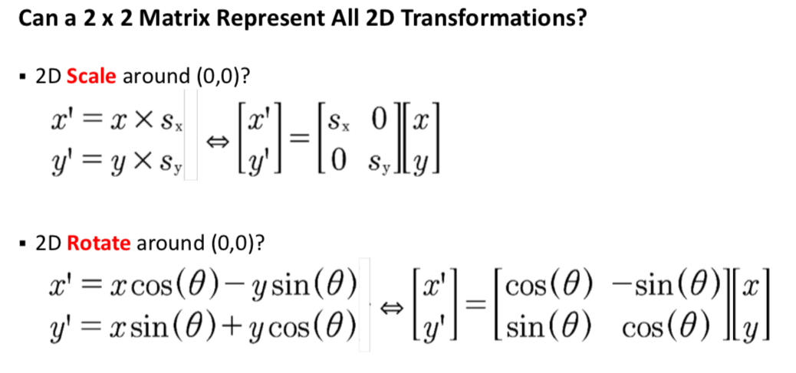
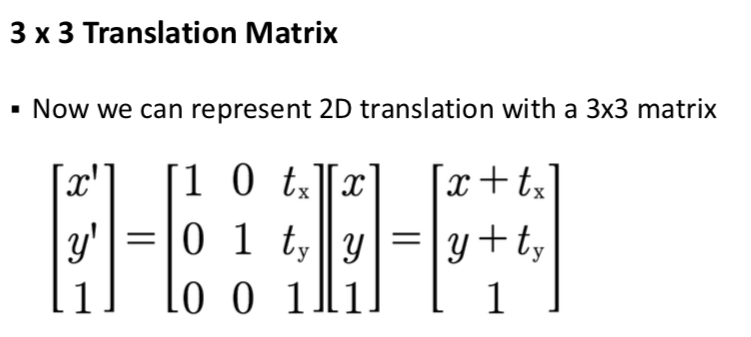

### Drawing
3 models: pixel, stroke and region

XWindows: client server arch
- apps are client, telling server what to draw

Graphics Context
- gather all options to structure and pass it to drawing routine (default params)
- XWindows: stored on server, less traffic

Painter's algorithm -> back to front!
- z-depth and sort

Repaint at high frequency = animated
- drawing + event + timer handling

XDRAWIMAGESTRING, XDRAWLINES

XSetClipRectangles -> to clip!

Double Buffering to fix Flickering of intermediate
- Draw to buffer then copy to screen!

Keep variable to see if things have changed (need to redraw)

**XFlush**

## Graphics
Java
- UI periodically walks up the tree, telling each component to draw itself (paintComponent method)
- GC passed around
- drawImage, drawLine, drawString, fillRect

Model -> Rendering -> Image (rendered Model)

Shape: isFilled, isClosed, etc.

Model -> Transform -> Model' -> Rendering -> Image (rendered Model)
- Transform: translation, rotation and scaling

rotate (x, y, $\alpha$)

Give a 2d matrix to do all transformation at once!

2D Matrix cannot be used to transform!

Solution: add W to coordinate -> divide by W to get cartesian coords

Other same as before!

Order still matters!