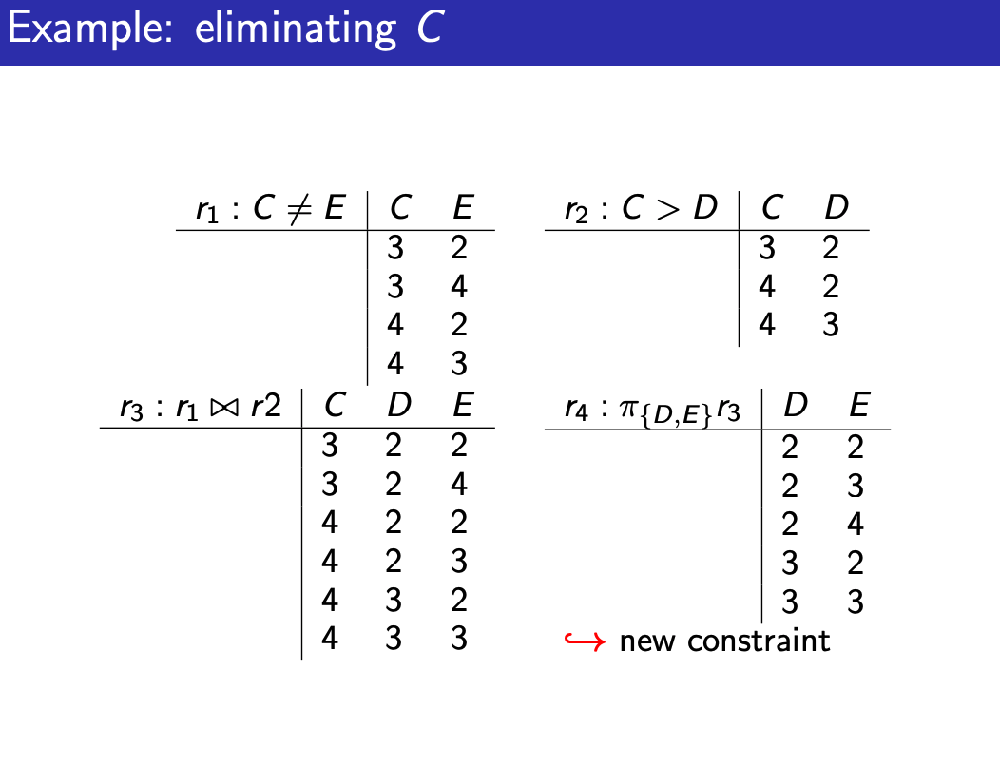
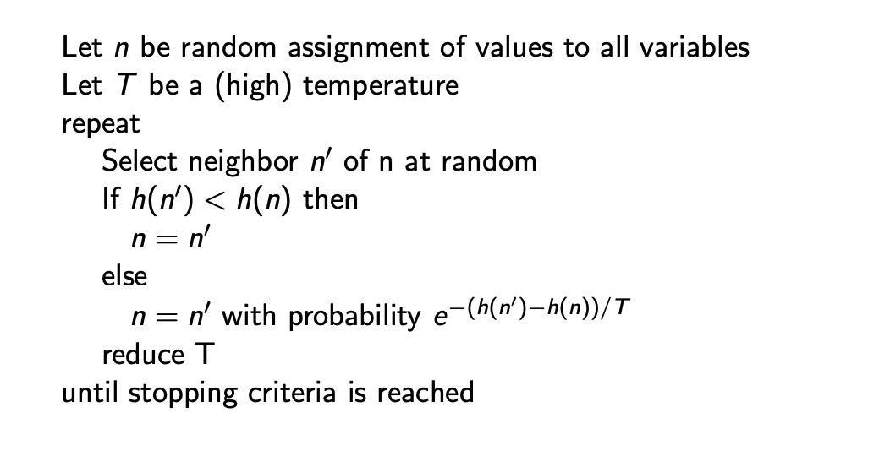

## L04, 1/19 Constraint Satisfaction Problems

Constraint Satisfaction Problems
- set of variables, domain for each variable
- set of constraints or evaluation function

2 types
- Satisfiability Problems: find assignment that satisfy constraints (hard)
- Optimization Problems: find assignment that optimizes (soft)

Solution: assignment that satisfy all constraints
- a **model** of constraints

CSP as Graph Problems
- 2 ways:
- Complete: 
  - nodes: assignment of values
  - neighbors: change of one variable
- Partial:
  - node: assignment to first k-1 variable
  - neighbors: assignment to k-th variable

Problem: no clear start, large trees, path can be ignored so not needed!

Constraints
- can be N-ary: over sets of N variables
- here: consider only unary and binary (crossword where words are the domain)

Ways:
- Generate and Test
- Backtracking
- Consistency
- Hill-Climbing
- Randomized Local Search

For simple cases with clear logic maps, we can do generate and test

### Backtracking
- if we know large part of state space cna be pruned, then we can optimize
  - order the variables
  - evaluate without full assignment
    - see if something is already failing

We keep trying at each instance, when something is exhausted, then we backtrack to another variable

Efficiency depends on order of variable!
- optimal ordering of variable is as hard as solving problem though!
- Idea: fail fast!!
  - put as little variable as possible to check first, then build up!

### Consistency
- More general approach, look for inconsistency
- ie. $if E \le A, where A \in \{1,2,3,4\}$ then $E \neq 4$
  - not wait for discovery of earlier variables

- Graphical approach instead of tree based

- Build a **constraint network** (CN)!
- domain constraint -> unary constraint on domain `<X, C(X)>`
- node in CN is domain consistent if no domain value value violates a domain constraint
  - CN is domain consistent iff true for all nodes
- Arc `<X, C(X, Y)>` is constraint on X
- arc is arc consistent if for each $X \in D_x$ there is some $Y$ so that the constraint is satisfied
  - CN is arc consistent iff true for all arcs
- set of variable $\{X_1, X_2, ..., X_n\}$ is path consistent iff all arc and domain are consistent

### AC-3
Make a CN **arc consistent (and domain consistent)**
- TO-Do Arcs Queue (TDA) has all inconsistent Arcs
- choose one arc at a time with a constraint
  - see if all values in domain of X has value in Y for `C(X, Y)`, remove from X if needed
  - if any removed from X, add All `<Z, C(Z, X)>` where Z is not Y or X

3 ways of termination: 
- every domain is empty -> impossible
- one solution
- some have more than 1 (split in two run on two halves, only add the `<Z, C(Z, X)>` on split domain X)

Variable Elimination
- Idea: eliminate variable 1 by 1 to pass constraints to neighbors
- if single variable left, no value left: then inconsistent!!
- we need to find elimination ordering
  - different ordering result in different intermediate constraints

Algo
- if one variable, return intersection of the constraints
- else, Select variable X
  - join all constraints of X, forming R
    - enforce R on all variables other than X
  - Replace all constraints where $X_i$ appears by a new constraints: $R_2$
  - Combine $R_2$ with all constraints between variables
  - Remove X
  - recurse
  - return R joined!

start from arc consistent network!

### Local Search
- assume Local search, where nodes are assignment to a value
  - heuristic improvements
- aim is to find an assignment with 0 unsatisfied constraints
  - given assignment, a conflict is an unsatisfied constraint
  - goal is 0 conflicts
  - Heuristic Function to minimize: # of conflicts

Variants: Greedy Descent
- Find variable-value pair that minimize at every step
- find variable with most conflict, select value with minimal conflicts
- select variable in any conflict, value that min conflicts
- select at random, find value with min conflict
- select at random, accept if no increase

GSAT - Greedy
- repeatly find neighbot that minimizes H(N)
- cant change same variable 2 times in a row though!

Problem: local minimum is not global minimum!
  - during plateaus where h(n) is useless, at ridge, a check can help (look ahead)

Randomized Greedy Descent
- as well as downward steps, we can randomly move to a neighbor and randomly reassign values to all variables?

At higher dimensions really hard to visualize and do local search!
- canyons are common!

### Stochastic Local Search
- mix of greedy descent, random walk (taking random steps) and random restart

Variant: simulated Annealing
- pick random variable and random new value
  - if improvement, take
  - if not, use $T$ and switch based on probability: $e^{-(h(n') - h(n))/T}$

- the higher the temperature the more likely the change (at T = 1, 1 diff is around 37%)
- reduce T everytime

Tabu Lists
- like GSAT: Never choose same variable twice!
- keep track of last `k` assignments

Parallel Search
- total assignment: individual
  - IDEA: maintain a population of `k` individuals instead of one
  - At each stage update the individual in the population
  - basically `k` times the number of steps and check multiple at the same time

Beam Search
- choose `k` best options (like parallel search)
- when `k = 1` -> greedy descent

Stochastic Beam Search
- probabilistically chooses `k` individuals at next generation
- probability it is chosen: $e^{-h(n)/T}$
- maintains diversity betterm heuristic reflect the fitness
- asexual reproduction

Genetic Algo
- pairs are combined to create offspring
  - randomly chooses pairs of individuals where fittest individuals are more likely
  - perform crossover: form two offspring each taking different part of parents and see what are the fittest
- depends on the effectiveness of ordering of variable

Comparing Stochastic Algorithm
- Check summary statistics: mean runtime, median, mode dont work

