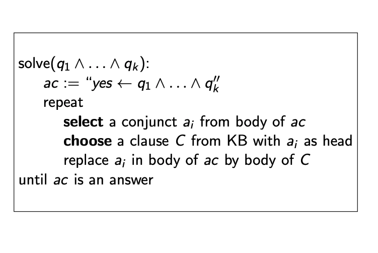
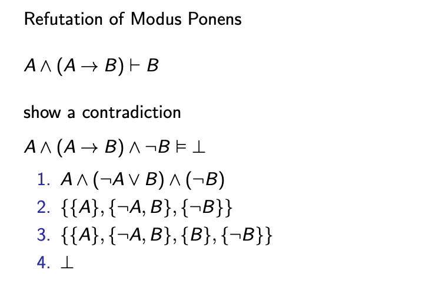

## L05, Propositional and Interference

2 ways to solve problems
- Procedural
  - device algorithm
  - program
  - execute
- Declarative
  - identify knowledge needed
  - encode knowledge in representation (Knowledge base - KB)
  - use logical consequences to solve

Procedural
- how to knowledge, programs, meanings of computation
- C, C++ etc.

Declarative
- descriptive knowledge
- meaning of symbol = real world
- prop logic, relational db

Proof Procedures
- Logic: syntax(what is acceptable sentence?), semantics (what do symbols mean) and proof procedure (what is valid)

A proof is a sequence of sentences derivable using inference rules

Modus Ponens = Tautology
`((A → B) ∧ A) → B`
If it’s raining then the grass is wet
it’s raining
therefore the grass is wet

Modus Tolens is a Tautology
`((A → B) ∧ ¬B) → ¬A`
If it’s raining then the grass is wet
the grass is not wet
therefore it’s not raining

Modus Bogus is **not** a Tautology
`((A → B) ∧ B) → A`
If it’s raining then the grass is wet
the grass is wet
therefore its raining (NOT TRUE)

Logical Consequences
- {x} -> set of statements
- a set of assignemnts is interpretation
- interpretation of {X} makes {X} true => **MODEL**
  - inconsistent if none exists

statement A is logical consequence of {X} if A is true in every MODEL of X

Validity
- Argument is Valid iff conclusion is logical consequence

if no premises are true, then conclusion dont matter hence statement holds

### Proofs
- KB -> set of axioms
- Proof Procedure: way of Proving
- A proof procedure is a way of Proving Theorems
- KB |-g means g can be derived from KB using the proof procedure
- If KB |-g, then g is a Theorem
- A proof procedure is sound:
`if KB |-g then KB |=g`.
- A proof procedure is complete:
`if KB |=g then KB |-g`.

Two types of proof procedures:
bottom up and top down

Assume closed world:
- agent knows everything, if cannot be proven, it is false

(Open world then we cannot do shit because agent cannot conclude shit)

Bottom Up Proof
- forward chaining - start from facts and use rules to generate all atoms

Top Down Proof
- start from query and work backwards

select: “don’t care nondeterminism”
(If one doesn’t give a solution, no point trying others!)
choose: “don’t know nondeterminism”
(if one doesn’t give a solution, others may)

Automated Methods
- make everything into CNF (Conjunctive Normal Forms)
- conjunction of disjunction of atoms
  - ands of ors

Try to show a contradiction with
- modus ponens
- anything with logical consequence (->)

Resolution:
- {A, B}, {C, $\neg B$} => {A, B}, {C, $\neg B$}, {A, C}
- Resolution Refutation
  - deny conclusion and show resolution becomes contradiction
  - use resolution to add clauses, the all are true, then the refutation of conclusion must be false
    - so must be valid

Constraint Satisfiability can become CNF
- variable Y with domain {$v_1$...$v_k$} becomes k variables {$Y_1$...$Y_k$} where it is true if it has value $v_i$
- thus, $k$ atoms are used to represent CSP