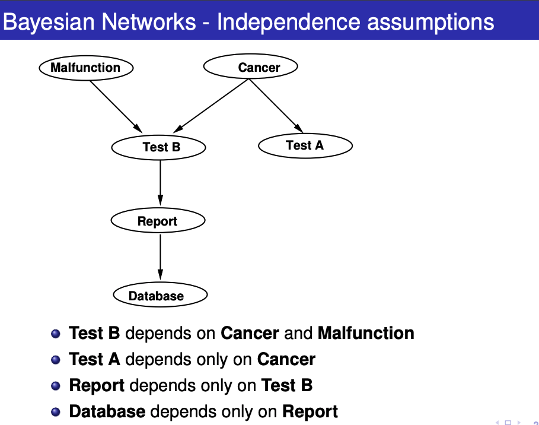

## Reasoning Under Uncertainty

- Agents do not know everything
- decisions made in absence of information or in noisy information

Frequentist vs Bayesian

- Frequentist: looks at what has happened, only uses history, and uncertainty is pertaining to the world
- Bayesian: looks at own belief which is based on previous experiences, uncertainty is pertaining to knowledge

Bayesian would look at all data to make belief choices, frequentist would just look at own past data

### Features

- Describe World is described in states
  - or as product of a set of features (attributes/random variables)
- Number of states: $2^\text{number of binary features}$
- Factorize to get to feature values

Note: Probability is the measure of ignorance

Independence can reduce the numbers needed to calculate probability distributions

Note: $P(x|y)$ is probability of X = x given Y = y

### Rules

Bayes Rule: $P(A|B) = P(B|A)P(A)/P(B)$ since $P(A, B) = P(A|B)P(B)$

Independence -> $P(A) = P(A|B)$

Expected Values: expected value of a function on X -> V(X)

- $E(V) = \sum_{x \in dom(X)}P(X)V(X)$

Values of independence -> reduces representation and inference from $O(2^n)$ to $O(n)$

- mutual independence is rare, but most have conditional independence

## Bayesian Network (AKA Belief Networks)

- Are Direct Acyclic Graph
- Encodes dependencies in a graphical way
- Edges: P(X|parents(X))

Correlation and Causality: Directed links are causal, it doesnt matter what causes what!

### Chain rule

Because of conditional probabilities and independence: after chain rule we can also simplify!

### Bayesian Networks

- Contains a DAG and a set of CPT (Conditional Probability Tables)
- Structure implies that X is conditionally independent of all its non- descendants given parents

- DB and Test B are independent if Report is observed
- Test A and Test B are independent if Cancer is observed
- Malfunction and Cancer and independent if Test B is **not** observed

### Testing Independence

- D-seperation: set of variables E d-seperates X and Y if it blocks every undirected path in BN

  - Basically "Blocked" means that they are independent

- **Markov Blanket** - minimal set of nodes that d-seperates _v_ from all other variables

  - parents, children and other parents of children

- 2 children -> the leaf node may change belief for the other one if the parent is not observed
- 2 parent -> the parent node may change belief for the other one if the child (or its children) is observed
  - this is the only case where the children can fully block a parent.

Reducing the number of dependencies reduces the number of variable we need to look at for the chain thing

"Car starting problem" - independence quiz

slide 29

- TravelSubway and Thermometer (given no evidence)? Dependent
- TravelSubway and Thermometer (given Flu or Fever)? Independent
- TravelSubway and Malaria (given Fever)? Dependent
- TravelSubway and ExoticTrip (given Jaundice)? Independent
- TravelSubway and ExoticTrip (given Jaundice and Thermometer)? Dependent
- TravelSubway and ExoticTrip (given Malaria and Thermometer)? Independent

$P(h|e) \propto P(e|h)P(h)$

^ e shows h (e causes h)

$P(e) = \sum_hP(h,e) = \sum_h P(e|h)P(h)$

Polytree algo: whats shown in class, figure out what is dependent, then chain rule, More generally, Variable Elimination Algorithm

slide 38

$P(F|J=true)\propto P(F, J=true)$

$\sum_cP(F,C, J=true)$

$\sum_cP(J=true|F,C)P(C, F)P(F)$

can expand $P(C,F)$ because J is not observed locally

$\sum_cP(J=true|F,C)P(C)P(F)$

$P(F)\sum_cP(J=true|F,C)P(C)$

- F=true: $0.1[0.95\times0.0001+0.99\times0.9999]=0.099$
- F=false: $0.9[0.99\times0.0001+0.01\times0.9999]=0.0091$

$P(F|J=true) = \frac{0.099}{0.099+0.0091} = 0.92$

Normalization Factor = $0.099+0.0091 = \sum_FP(F, J=true)$

### Factors

Factors does not have to add up to 1, will bring in NF (Normalizing factor) last minute

- They can have certain variables already set
- product of Factor -> cartesian product etc.
- sum out variable -> add where the X is equal (remove X from the factor)
- to be efficient: sum then product! (sums of product needs to be done effectively)

### Variable Elimination Algo

- construct all factors
- set all known variable
- sum out according to elimination ordering
- multiply remaining, normalize resulting factor!

- Dependent on elimination ordering
  - polytree: work outside in!
  - NP-Hard problem generally

#### Variable ordering

- eliminate singly-connected nodes first
- relevance - eliminate those not needed (duh!)
