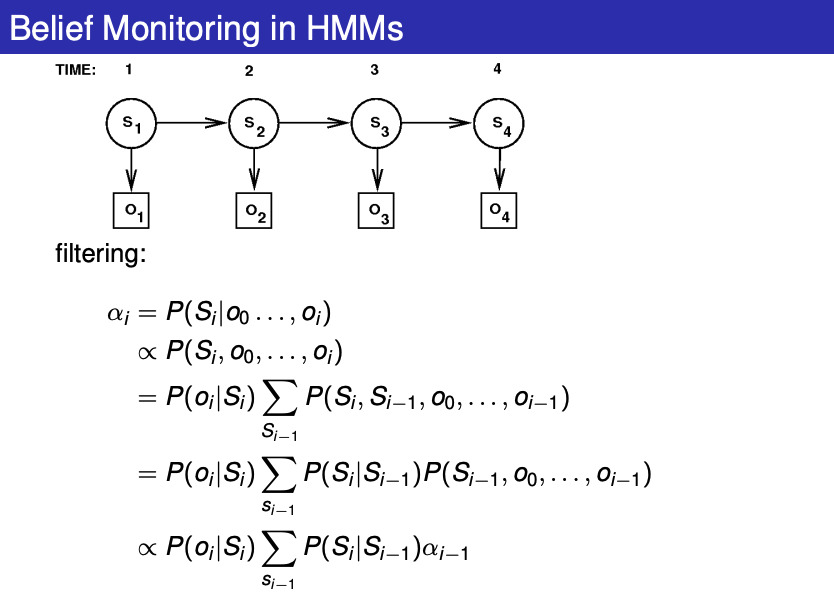
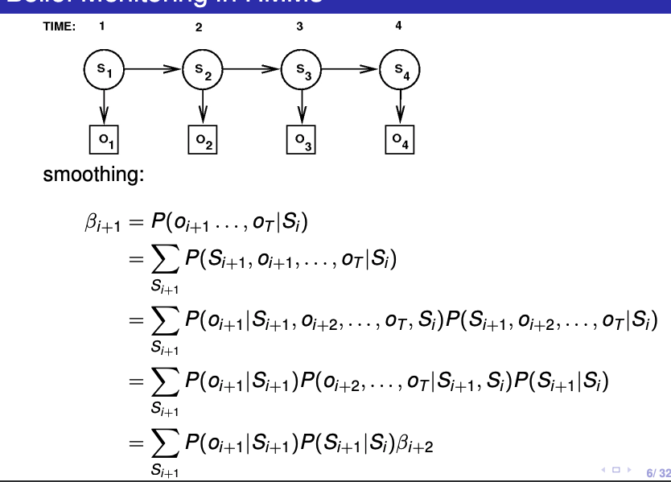
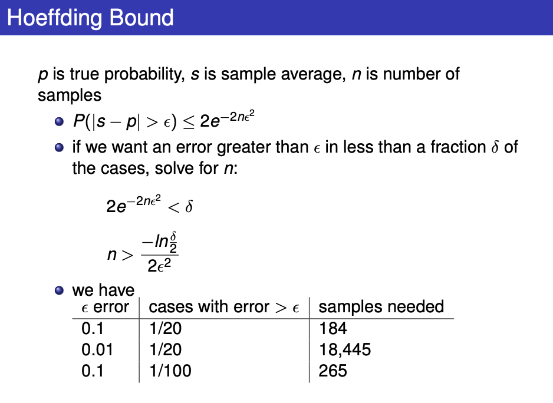
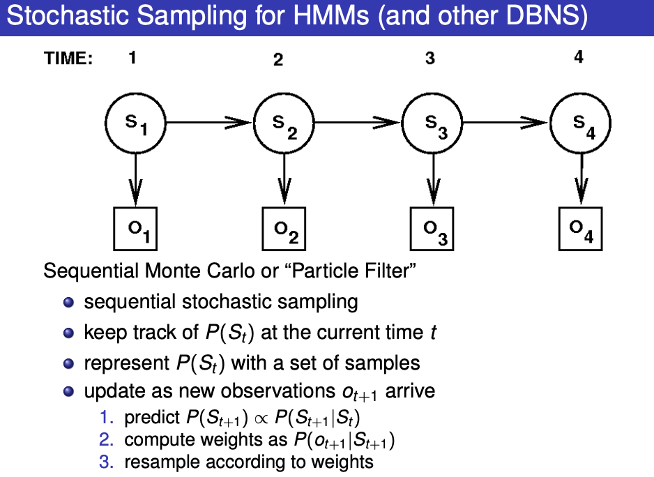

### L8 Uncertainty Part II

### Probability and Time:

- Node repeats over time, explicit encoding of time
- Chain has length: amount of time you want to model
- EG: Markov Chain
  - Markov assumes that each time is only directly dependent on the previous time (note that the prob chain still chains...)

Hidden Markov Models

- Add observations $O_t$ -> always observed
- Given a sequence of observations we can use
  - filtering: $P(S_t|O_1, ..., O_t)$
  - smoothing: $P(S_k|O_1, ..., O_t)$, k < t
- Used for speech recognition

Belief Monitoring in HMM

- Filtering

- Smoothing

Filtering is when you are only allowed to use past data to make an estimate. Smoothing is when you are allowed to use both past and future data to make an estimate.

A Markov process is one where all future states can be determined by only the current state, you do not need to know anything about the past history. A hidden-markov model is one where you don't observe the states directly but only some output dependent on the state.

### Dynamic Bayesian Networks

- problematic when time and event driven -> too many variables now , VE does not work!
- IE Localization is hard (robot finding where he is based on sensors)

### Stochastic Simulation

- idea: generation probability from samples, sample the past probability from the past actions/results
- since some models are large, doing VE is too slow so this is better.
- Generate random samples and compute values of interest from samples, not original network
- We need a good estimation to get error less than an amount:

- This is basically the process to show why Conditional Probability Tables is better.

#### Forward Sampling

- Sample variables one at a time, starting from parent then to child
- Given all parent's value, then sample from the probability of X given parents.
- I.E P(H=y | E=x) = $\frac{Num(H=y and E=x)}{Num(E=x)}$
- As number of samples goes up, it will get more accurate
- Sample the whole thing based on the topological order of the variables.

#### Rejection Sampling

- Forward sampling except the samples with unrequested values ($E\ne x$) will get rejected and tossed out. Non-rejected are distributed based on the posterior prob.
- NOTE: in the Hoeffding bound, n is the number of non-rejected samples

Instead you can also just put in weights in place of the sampling, hence not needing to generate majority of it

Proposal Distribution q(a)

- We can give each sample the new weight of P(a)/q(a)
- Useful if P(A) hard to sample, we can then look back and find out what to do with q(A) after.
- rejection sampling uses this method,
- We sometimes want to skew the proposal based on prior knowledge.

#### Stochastic Sampling for HMMs (and other DBNS)

Sequential Monte Carlo or "Particle Filter"

- Sequential Sampling (stochastic)
- keep track of $P(S_t)$ and represent it with a set of variables
  - update this as new observation arrives $o_{t+1}$
  - predict $P(S_{t+1}|S_t)$
  - compute new weights from $P(o_{t+1}|S_{t+1})$ and resample!

* Predict -> Spread -> Evidence (-> Resample)

performance of algo dependent on resampling method

- avoid degeneracy of data
