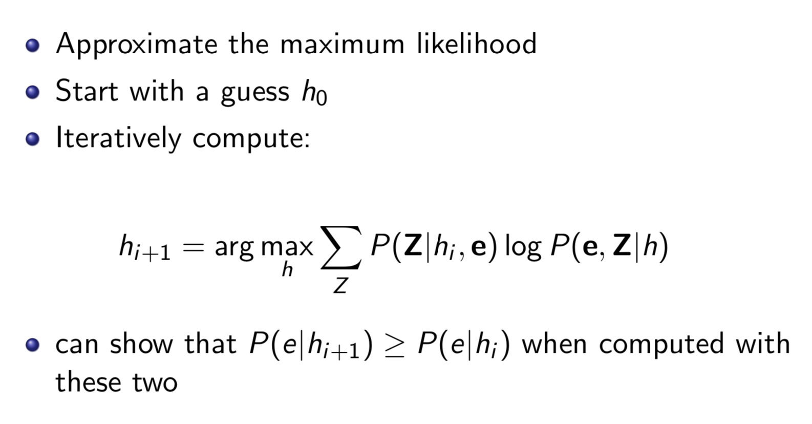
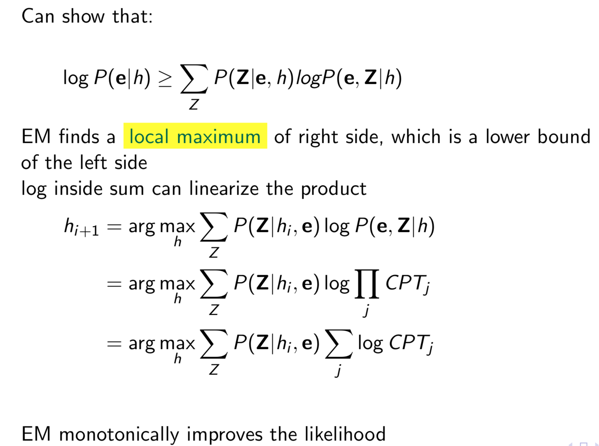
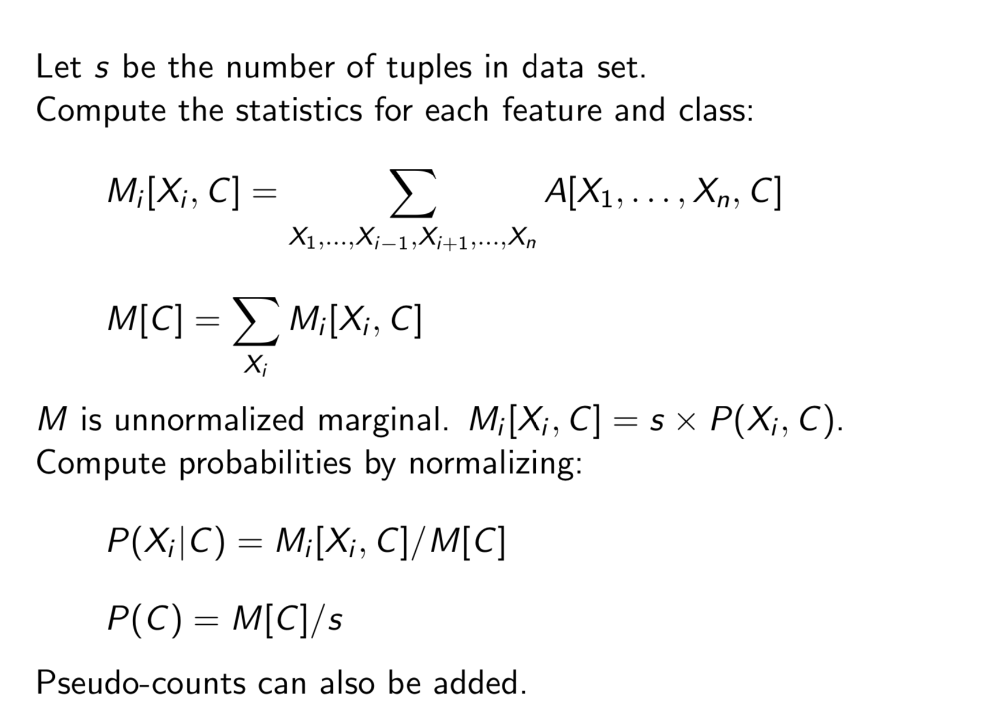

# L13, Learning over Uncertainty pt 2

## Incomplete Data

- In the real world, many values are latent or missing!
- Incomplete Data -> Unsupervised Learning!!

- from before: $θ_{V =true,pa(V )=v} = P(V = true|pa(V ) = v)$
- With ML: $θ_{V =true,pa(V )=v} = \frac{\text{Number of V=true and pa(V)=v}}{\text{pa(V)=v}}$

- Options: when data is missing
  1. You can ignore the hidden variable, or
  2. You can ignore records with missing value (which does not work with real latent values - delayed values)
     - You cannot just ignore records carelessly, some give valuable information (Missing Bias)
     - Often data missing is not at random, need to keep track of them too!
  3. Maximize likelihood directly
     - If we knew missing value, computing ML is easy again!
     - Hence "Expectation Maximization"
  4. Really simple version - "K-means algorithm"
     - Based on $h_{ML}$, compute most likely missing information: $argmax_z(P(Z|h_{ML},e))$
       - now you keep going!

## Expectation Maximization

- Guess $h_{ML}$, iterate
  - Expectation: Based on $h_{ML}$ guess the missing values $P(Z|h_{ML},e)$
  - Maximization: Based on the expected values, refine $h_{ML}$ and loop

- monotonically improves the likelihood with each iteration

## k-means algo

- used for hard clustering
- starts with: training data, number of classes: k
- output: a prediction of a value for each target feature for each class, assignment of the training data to classes

Algorithm:

- pick k means, one per class
- iterate until the means stop changing
  - assign examples to k classes based on closest mean,
  - re-estimate the k means based on the assignment

## Augmented Data Method

- If missing data, just augment the data with entries based on the missing value's domain and put the value as the P(missing|data)

## M step

That is the formal way of looking at it, essentially, compute statistics for each feature and class. and the compute the probabilities by normalizing it based on the values.

## General Bayes Network EM (with missing data)

(Just formal defs)

## Belief Network Structure Learning

$P(model | data) = \frac{P(data | model) P(model)}{P(data)}$

- A model here is a belief network.
  - $P(data | model)$ -> A bigger network can always fit the data better.
  - $P(model)$ -> allow us to give encoding for a smaller model preference (via description length for example)
- We can search for the best model over the whole network for belief networks (hella meta...)

- Given total ordering, can do independence test to see what should be parents.
- XOR problem: just because feature does not give value by itself, combined with other it can provide value
- search over the totol ordering of variable
