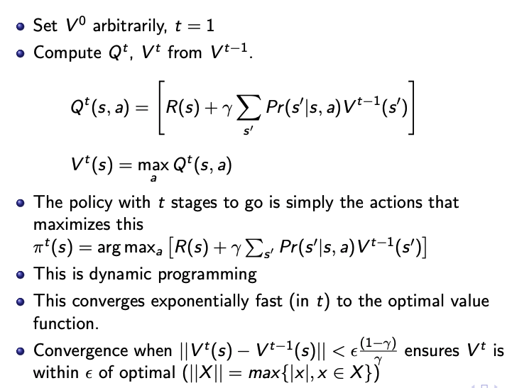
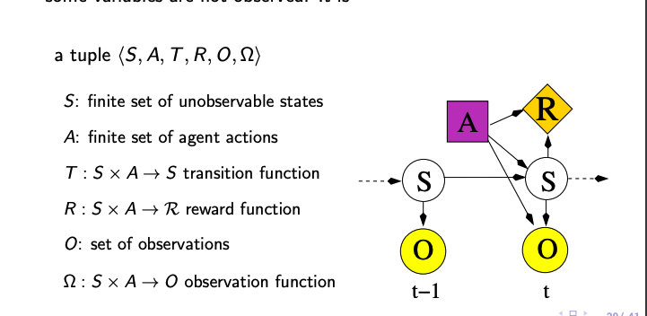

# L15, Planning 2

Agents carry out actions:

- forever -> infinite horizons
- until some stopping criteria -> indefinite horizon
- fixed/finite steps -> finite horizon

Decision-theoretic Planning

- what should agent do when it
  - gets reward/punishment and try to optimize rewards
  - actions are noisy: outcome of action is of another action
  - there is another model that specifies prob. outcome of actions
  - assume world is fully observable

World State

- the information such that if you knew the world state, no info from past is relevant to future
  - Markovian Assumption!
  - $P(S_{t+1} | S_0, A_0,..., S_t, A_t) = P(S_{t+1} | S_t, A_t)$
- **Dynamics is stationary if distribution is the same for each time point!**

Planning Horizons: how far ahead the planner looks to make decision (infinite, indefinite, finite)

## Decision Process - Markov Decision Process

Augmented Markov Chain with actions and values (utility)

Specify

- Set S of states
- Set A of actions
- $P(S_{t+1} | S_t, A_t)$ is the dynamic
- $R(S_t, A_t, S_{t+1})$ is the reward. Agent gets reward at each time step, this is the EXPECTED reward

Information Availability

- Fully Observable MDP -> agent gets to observe $S_t$ when deciding on action $A_t$
- Partially Observable MDP -> some noisey sensor of state, needs to remember its sensing and acting history -> maintainig a complex belief state.

Rewards and Values

- When an agent receives a sequence of rewards -> what value should be assigned?
  - Total Rewards
  - Average Rewards
  - Discounted Rewards $V = r_1 + ar_2 + a^2r_3..., 0 \le a \le 1$ hence diminishing in value.

Policy

- Stationary Policy: $\pi: S->A$
  - dictates what the agent should do given state S
  - Optimal: Discounted Rewards that is Max!
- Fully Observable MDP with **stationary dynamics** and rewards, always a optimal stationary policy
  - Later example will show that the distribution does not change!!

Value of a Policy

- $Q^\pi(s,a)$ the expected value of doing $a$ in state $s$, following policy
- $V^\pi(s)$ the expected value of following policy in state $s$, following policy
- $Q^\pi(s,a) = \text{Sum of future decisions times its reward}$
- $V^\pi(s) = Q^\pi(s, \pi(s))$

Value of Optimal Policy

- Basically, choosing the max and argmax!

Note in these images: the weird thing is the discount factor!

## Value Iteration

- Look ahead value function: $V^t$ -> expected value with $t$ steps to go
- Set $V^0$ arbitrarily, t=1
- Compute $Q^t, V^t$ from $V^{t-1}$

Note in these images: the weird thing is the discount factor!

### Example

After, to do iteration, basically row 1 = $P(s' |s, A = a)V^0(s')$ and row 2 = $P(s' |s, A = b)V^0(s')$, then u find the best value of the rows, and decide which decision A is the best for $\pi$

After this, each iteration, use the previous Max from $\max_a(Q^i(s, a))$

## Asynchronous Value Iteration

- No need to check all the states, but can update value function for each state individually
- You can store either $V[s]$ or $Q[s,a]$
- Basically loop forever while storing this

### Markov Decision Processes: Factored State

- Not 1 S, $S = {X_1, ...}$
- For each $X_i$, and action A -> $P(X_i'|S, A)$ basically the P function now has a bunch fo sub function
- Rewards function gets the same treatment and is additive!

For All cases:

- $P(S'|S,a)$ = [num state x num state]
- $R(s)$ = [num state x 1] -> Reward at each state!

## POMDPs

- Similar to MDP, but some variables are not observed!

V(b) can be represented with a piece wise function over the belief space

## Policies

- Map beliefs states into actions $\pi(b(s)) \to a$
- 2 Ways for compute policy
  - Backwards Search
    - DP (Variable Eliminations)
    - What we have done above with $Q_{t}(s, a)$
      - POMDP: $Q_{t}(b(s), a)$
      - b is belief states
    - point based backup make this efficient
  - Forward Search - Monte Carlo Tree Search
    - Expand the search tree
    - expand more in promising directions
    - Ensure exploration using things like UCB

## Monte Carlo Tree Search

- Selection: select node to visit based on tree policy
- Expansion: new node added to tree upon selection
- Simulation: Run trial simulation from a default policy from the new node until terminal
- Back propagation: sampled statistics from the simulation is given back from child to ancestors

I doubt we need to know this shit but here:

