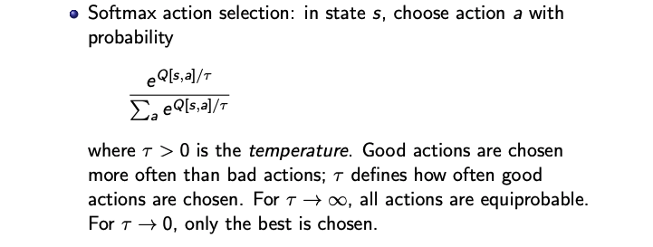

# L16, Planning under uncertainty pt 3

## Reinforcement Learning

- Agent given: prior knowledge, observation (including immediate rewards) and goal
- Like the Decision Theoretic Planning, but model of dynamics and model of reward not given!

Assume Sequence of experiences: State -> Action -> Reward

Why is Reinforcement Learning Hard?

- What actions responsible for reward may have been a long time ago
- Long Term effect of action depends on what it will do
- Explore-Exploit dilemma!
  - Agent decide between explore: more knowledge and exploit: use existing knowledge

Main Approaches

- Search through a space of policies
- learn a model consisting of state transition function $P(s'|a, s)$ and $R(s,a, s')$ -> Solve as MDP
- learn $Q^*(s,a)$ -> use this to guide action

### Model Based Reinforcement Learning

- Uses the experiences in a more effective manner
- Used when collecting experiences is expensive and you have a lot of computation between each experience
- IDEA: learn MDP and interleave acting and planning

  - After each experience, update probabilities and the reward -> do some async value iteration

- Key points: Keep track of $Q[S,A], T[S,A,S], R[S,A]$ and $T[S,A,S]$ is just prior counts.

Note: The reward function is based from some temporal differences calculation

- $kA_k = (k-1)*A_{k-1} + v_k$
- $kA_k = (k-1)*A_{k-1} + v_k$
- $\alpha = 1/k$ then this becomes TD formula as each new value arrives:
- $A_k = (1-\alpha)*A_{k-1} + \alpha v_k$

## Q-learning

- Idea: Store Q[S,A] and update this like in Async Value Iteration
  - Use best experience instead of CPT (empirical prob instead)
- Experience: $<s, a, r, s'>$
  - provided to update Q[s,a]
  - experience provides data point: (assuming $\rho$ is discount factor)
    - $r+\rho\max_{a'}Q[s',a']$
    - Apply this to the TD formula
    - $Q[s,a] = Q[s,a] + \alpha(r+\rho\max_{a'}Q[s',a']-Q[s,a])$

Convergence and Termination

- N(s,a): number: number of time action a taken in state s
  - make this the learning rate: $\alpha$
- Q-learning converges if every state-action visited infinite times.
  - set convergence to be when average over last N steps is below $\epsilon$
- Q-learning converges to optimal if each state/action tried enough
  - But what should it do? exploit vs explore?

Exploration Strategies

- $\epsilon$-greedy strategy: choose a random action with probability $\epsilon$ and best action with choose a random action with probability $1- \epsilon$
- Softmax action selection:

- "optimisim in face of uncertainty" -> initialize Q to values that encourages exploration
- Upper Confidence Bound (UCB) -> Also store N[s,a] to keep track number of times s, a chosen
- $\text{argmax}_a[Q[s,a]+k\sqrt{\frac{N[s]}{N[s,a]}}]$

Back to the example

- Off/On Policy Learning
  - Q-learning does off-policy learning: learns value of the optimal policy regardless of what it does
    - bad if exploration should NOT be done
  - On-policy: learns the value of the policy being followed -> if current policy is to explore, it can optimize what it should do
    - SARSA uses $< s, a, r, s', a' >$ to update Q[s,a]

## SARSA

Doubt we need to know this...

##Q-function Approximation

- Difficult for large state spaces
- Linear vs non-linear
  - Linear still converges
  - Non-linear may diverge... to mitigate:
    - Experience Replay
      - Sample a batch of previous experiences at each step to learn
        - breaks correlation between successive updates
    - Use 2 Q function
      - Q network: currently used and updated
      - Target network: occasionally updated
        - Update using mini-batch

## Bayesian Reinforcement Learning

- Include Transition Function and Observation Function in state space
  - Learning through inference (belief space)
  -
