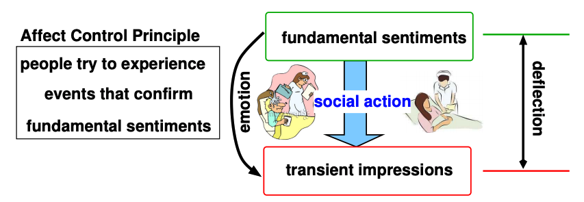

## L17, Affective Dynamics and Control

- AI Lacks empathy, altruism, culture and emotion (which is now needed for intelligence)

Low Road vs High Road: Thinking fast and slow.

- System 1: Fast: operates fast and quickly
- System 2: Slow: more mental activity (System 1 calls on this when in trouble)

Affective Computing: cognitive machine disrupted by emotion (perception -> cognition (emotion) -> action)

## Affect Control Theory:

- emotional machine disrupted by cognition (perception -> affect (cognition) -> action)
- People try to experience events that confirm fundamental sentiments

  - Shared sentiments, emotional dynamics and consistency->cooperation

- Actor - Behavior - Object
- Affect Control Principle: Actors work to experience transient impressions that are consistent with their fundamental sentiments
- Calculate Deflection from the Object as feedback

Bayesian Affect Control Theory - Model Uncertainty
