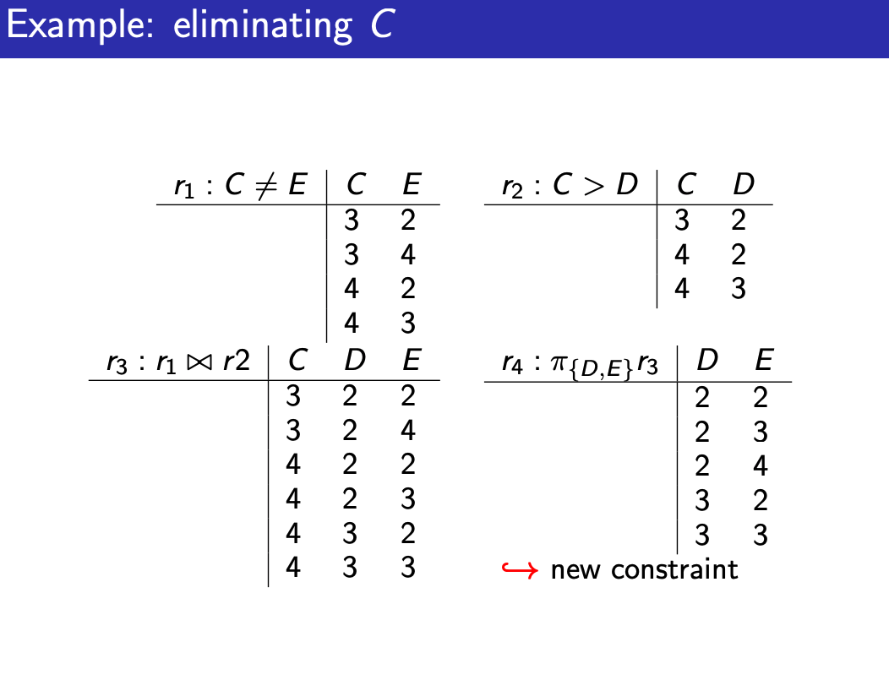
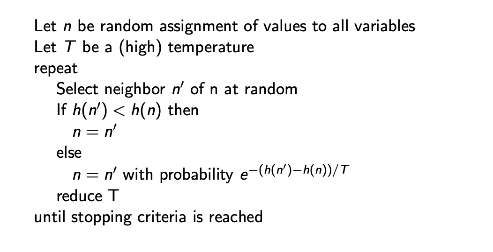
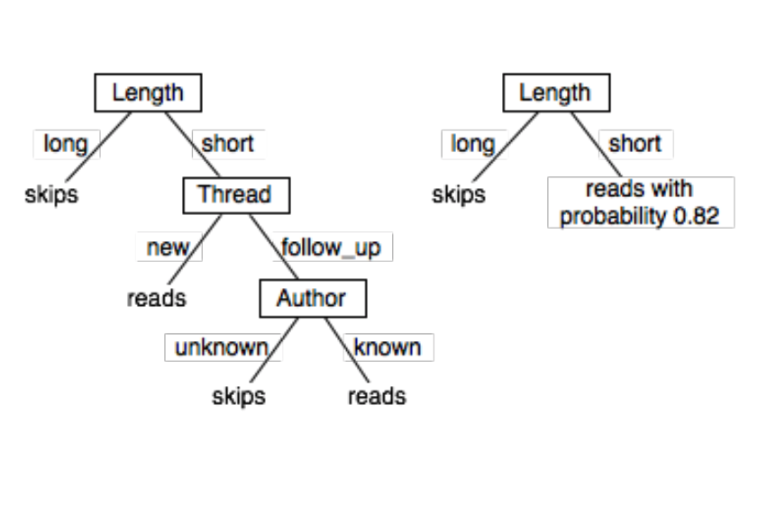
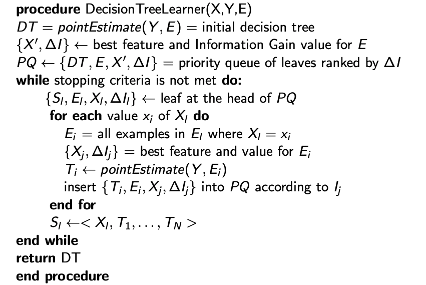
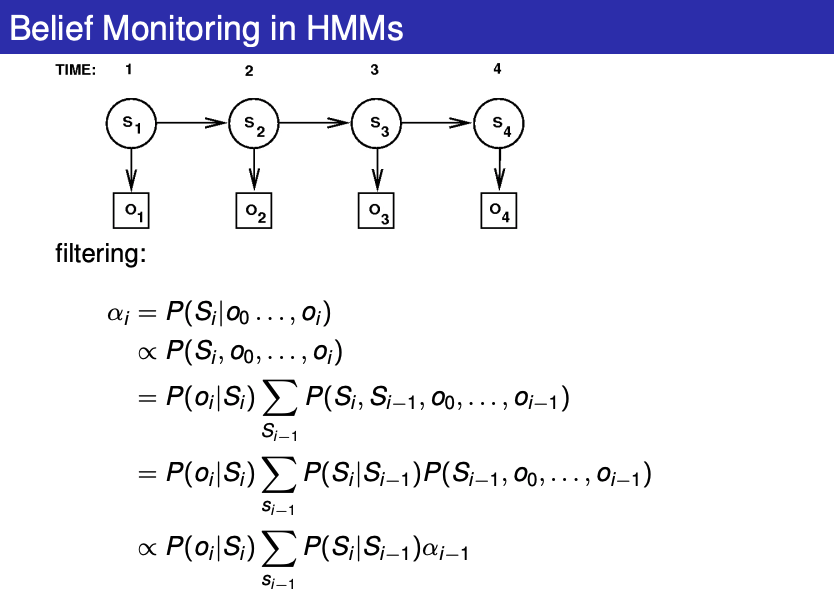
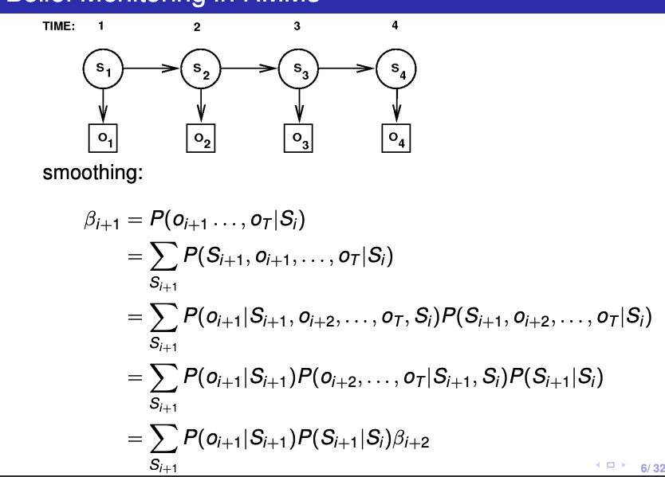
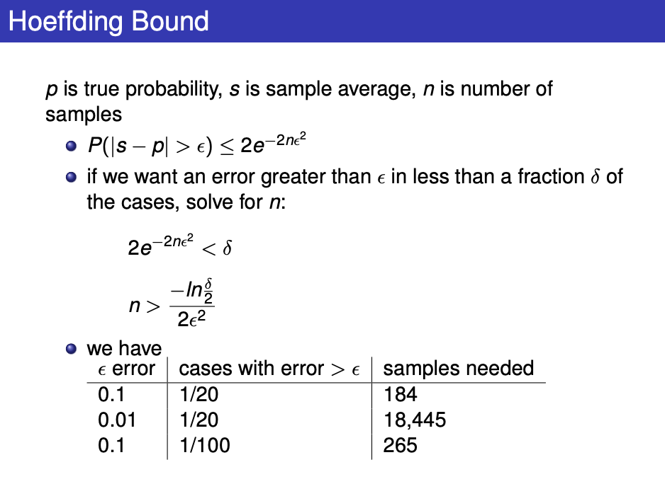
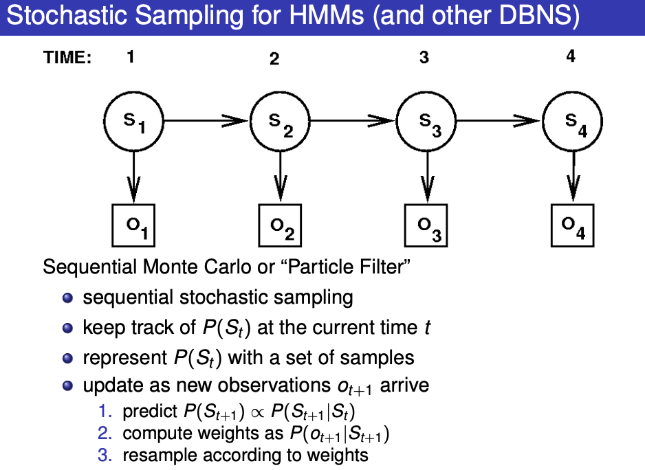

# L01, 1/7

What is AI?

- The synthesis and analysis of computational agents that act intelligently.

An agent acts intelligently when

- what it does is appropriate for its circumstances and its goals, taking into account the short-term and long-term consequences of its actions
- it is flexible to changing environments and changing goals
- it learns from experience
- it makes appropriate choices given its perceptual and computational limitations

# L02, 1/9

Studies of AI

- Mimic Life: build artificial versions of things
  - heart, animals, etc.
- understand principles and make machines that embodies them

Low Road vs High Road

Cognitive vs Affective Thinking

Traditional AI

- Environment -> perception -> cognition (-> emotion) -> action -> environment

Socio-Cultural View

- Environment -> perception -> affect (-> cognition) -> action -> environment

Emotions: New AI

- AI -> Intelligence = rationality
- emotions are needed for intelligence
- low road offers _heuristic_ social intelligence
  - provide a social order

## L03 (Lecture 2), 1/12

Agent perform actions to affect the enviornment

- makes decisions based on abilities, goals/prefernces, prior knowledge, stimuli and past experiences

Knowledge Representation - Symbol Systems

- Symbol is a meaningful physical pattern that can be manipulated
- Symbol system: create, copies, modifies and destroys symbols
- Physical Symbol System Hypothesis:
  - a PSS has the necessary and sufficient means for general intelligent action
    - AI on computer is possible in theory, but not feasible in practice

Good representation:

- Expressive, close to problem (compact and maintainable), amenable to efficient computation, amenable from more input

Decision making for AI

- Abilities: what can it do
- Observations: direct input from environment
- Prior Knowledge: knowledge base when developed (map, capabilities)
- Past Experiences
- Goals

Dimensions

- Research leads to simplifying assumptions and reducing them
  - each simplification leads gives a new _dimension_
    - can be multiple values - simple to complex values
    - combine these assumptions

Much of AI is to find compact representations and exploiting it for computational gains

Agent reason in terms of

- explicit states
- features/propositions
- individuals + relations
  - feature for each relationship on tuples of individuals

Planning Horizon

- how far Agent looks into future when deciding
  - static: world does not change
  - finite stage: fixed number of time steps
  - indefinite stage: finite but not predetermined #
  - infinite: plan for going forever

Uncertainty

- what agent can determine the state from observations
  - Fully observable: know the state of world from observation
  - Partially Observable: there's many states that are possible from observation

Uncertain Dynamics

- if the agent knew initial state and action, can it predict the ending state?
  - deterministic: can be determined from action and state
  - **stochastic**: uncertainty over states resulting from action from state

Goals or complex preferences

- achievement goals: goal to be reached
- maintenance goal
- complex preferences: tradeoff between decisions

Single agent: reasoning is where agent assume other agents are part of the environment

Multiple agent: agent needs to reason about the reasoning of other agents

Knowledge can be given or learned from data or past experience

Perfect rationality: agent can determine best course of action, net of limited computational power

Bounded rationality: makes good decisions based on limitations

## L04, 1/13, States and Searching

- A graph consists of a set N of nodes and a set A of ordered pairs of nodes, called arcs .

Maintain a **frontier** of paths that have been explored

Search strategy determines how the frontier expands

Types of search

1. Uninformed (Blind)
2. Heuristic
3. More sophisticated "hacks"

DFS - not guaranteed to end for infinite graph and cycles

- add extra cycle check
- linear in space complexity

BFS - queue format

- needs to be aware of **branching factor**
  - if guaranteed to be finite, then will for sure find solution
- time complexity is exponential on BF -> $bf^n$, n being length
- space complexity as well

Lowest Cost first search

- cost of path is the sum of all costs for each arc
- greedy: choose lowest cost first at each stage
  - keep in priority queue, when tied, BFS

### Heuristic Search

- don't ignore goals when searching
  - use extra knowledge - **heuristic**
- takes into account of h(n) -> estimated cost
  - make sure always underestimate
- eg. Manhattan distance, speed, straight line

Greedy best first search, only care about h, not optimal

Heuristic DFS - add to stack according to `h`

- locally does a best first search, same problems as DFS

A\* search

- use both path cost and `h`
- `f(p) = h(p) + c(p)`
- mix of both lowest cost first and best first
- always choose the lowest by `f(p)` in priority queue
- A\* usually finds the best solution
  - when BF is finite, all arcs are none-0, `h` underestimate the costs
- **Admissible H(n) never overestimate the costs**

### Constructing a Heuristic

- Relax the game, make it easier
- find which heuristic works best in each simplification

| Strategy              | Frontier Selection | Halts? | Space  | Time |
| --------------------- | ------------------ | ------ | ------ | ---- |
| Depth-first           | Last node added    | No     | Linear | Exp  |
| Breadth-first         | First node added   | Yes    | Exp    | Exp  |
| Heuristic depth-first | Local1 min h(n)    | No     | Linear | Exp  |
| Best-first            | Global2 min h(n)   | No     | Exp    | Exp  |
| Lowest-cost-first     | Minimal cost(n)    | Yes    | Exp    | Exp  |
| A ∗                   | Minimal f(n)       | Yes    | Exp    | Exp  |

Path Pruning

- for DFS -> constant time as you can add flags
- other cases, linear time in length of the path

Multiple Path Pruning

- prune a path to `n` that a path to has already been found for
- store all node already discovered path to

Problem: what if we end up discovering a path that is shorter for n?

- go back and fix every path's prefix
- remove the old paths
- ensure this does not happen: shortest path first (lowest-cost-first search)

Monotonic Restriction

- $h(m) − h(n) ≤ cost(m, n)$ for every arch
- make sure heuristic estimate is always less than actual cost
- If h satisfies the monotone restriction, A ∗ with multiple path pruning always finds the shortest path to a goal.
- basically, _admissible_ between any 2 nodes!

Iterative Deepening

- all halting algo requires exp space
- what if recompute the frontier instead of saving them
- depth-bounded DFS

Note: searching is symmetrical, if forward does not work, then check backwards (BF for forward vs backward: in vs out)

Bidirectional: use both sides

- use BFS to try to get to the middle, and see if the other side can meet the frontier
- save exponentially in time and space

Island driven search

- find all the path in between and make it into `m` subproblems

  - hard to say which path are correct and which are good island

- DP: work backwards find the cost and store it for each node
- ## L04, 1/19 Constraint Satisfaction Problems

Constraint Satisfaction Problems

- set of variables, domain for each variable
- set of constraints or evaluation function

2 types

- Satisfiability Problems: find assignment that satisfy constraints (hard)
- Optimization Problems: find assignment that optimizes (soft)

Solution: assignment that satisfy all constraints

- a **model** of constraints

CSP as Graph Problems

- 2 ways:
- Complete:
  - nodes: assignment of values
  - neighbors: change of one variable
- Partial:
  - node: assignment to first k-1 variable
  - neighbors: assignment to k-th variable

Problem: no clear start, large trees, path can be ignored so not needed!

Constraints

- can be N-ary: over sets of N variables
- here: consider only unary and binary (crossword where words are the domain)

Ways:

- Generate and Test
- Backtracking
- Consistency
- Hill-Climbing
- Randomized Local Search

For simple cases with clear logic maps, we can do generate and test

### Backtracking

- if we know large part of state space cna be pruned, then we can optimize
  - order the variables
  - evaluate without full assignment
    - see if something is already failing

We keep trying at each instance, when something is exhausted, then we backtrack to another variable

Efficiency depends on order of variable!

- optimal ordering of variable is as hard as solving problem though!
- Idea: fail fast!!
  - put as little variable as possible to check first, then build up!

### Consistency

- More general approach, look for inconsistency
- ie. $if E \le A, where A \in \{1,2,3,4\}$ then $E \neq 4$

  - not wait for discovery of earlier variables

- Graphical approach instead of tree based

- Build a **constraint network** (CN)!
- domain constraint -> unary constraint on domain `<X, C(X)>`
- node in CN is domain consistent if no domain value value violates a domain constraint
  - CN is domain consistent iff true for all nodes
- Arc `<X, C(X, Y)>` is constraint on X
- arc is arc consistent if for each $X \in D_x$ there is some $Y$ so that the constraint is satisfied
  - CN is arc consistent iff true for all arcs
- set of variable $\{X_1, X_2, ..., X_n\}$ is path consistent iff all arc and domain are consistent

### AC-3

Make a CN **arc consistent (and domain consistent)**

- TO-Do Arcs Queue (TDA) has all inconsistent Arcs
- choose one arc at a time with a constraint
  - see if all values in domain of X has value in Y for `C(X, Y)`, remove from X if needed
  - if any removed from X, add All `<Z, C(Z, X)>` where Z is not Y or X

3 ways of termination:

- every domain is empty -> impossible
- one solution
- some have more than 1 (split in two run on two halves, only add the `<Z, C(Z, X)>` on split domain X)

Variable Elimination

- Idea: eliminate variable 1 by 1 to pass constraints to neighbors
- if single variable left, no value left: then inconsistent!!
- we need to find elimination ordering
  - different ordering result in different intermediate constraints

Algo

- if one variable, return intersection of the constraints
- else, Select variable X
  - join all constraints of X, forming R
    - enforce R on all variables other than X
  - Replace all constraints where $X_i$ appears by a new constraints: $R_2$
  - Combine $R_2$ with all constraints between variables
  - Remove X
  - recurse
  - return R joined!

start from arc consistent network!



### Local Search

- assume Local search, where nodes are assignment to a value
  - heuristic improvements
- aim is to find an assignment with 0 unsatisfied constraints
  - given assignment, a conflict is an unsatisfied constraint
  - goal is 0 conflicts
  - Heuristic Function to minimize: # of conflicts

Variants: Greedy Descent

- Find variable-value pair that minimize at every step
- find variable with most conflict, select value with minimal conflicts
- select variable in any conflict, value that min conflicts
- select at random, find value with min conflict
- select at random, accept if no increase

GSAT - Greedy

- repeatly find neighbot that minimizes H(N)
- cant change same variable 2 times in a row though!

Problem: local minimum is not global minimum!

- during plateaus where h(n) is useless, at ridge, a check can help (look ahead)

Randomized Greedy Descent

- as well as downward steps, we can randomly move to a neighbor and randomly reassign values to all variables?

At higher dimensions really hard to visualize and do local search!

- canyons are common!

### Stochastic Local Search

- mix of greedy descent, random walk (taking random steps) and random restart

Variant: simulated Annealing

- pick random variable and random new value

  - if improvement, take
  - if not, use $T$ and switch based on probability: $e^{-(h(n') - h(n))/T}$

- the higher the temperature the more likely the change (at T = 1, 1 diff is around 37%)
- reduce T everytime



Tabu Lists

- like GSAT: Never choose same variable twice!
- keep track of last `k` assignments

Parallel Search

- total assignment: individual
  - IDEA: maintain a population of `k` individuals instead of one
  - At each stage update the individual in the population
  - basically `k` times the number of steps and check multiple at the same time

Beam Search

- choose `k` best options (like parallel search)
- when `k = 1` -> greedy descent

Stochastic Beam Search

- probabilistically chooses `k` individuals at next generation
- probability it is chosen: $e^{-h(n)/T}$
- maintains diversity betterm heuristic reflect the fitness
- asexual reproduction

Genetic Algo

- pairs are combined to create offspring
  - randomly chooses pairs of individuals where fittest individuals are more likely
  - perform crossover: form two offspring each taking different part of parents and see what are the fittest
- depends on the effectiveness of ordering of variable

Comparing Stochastic Algorithm

- Check summary statistics: mean runtime, median, mode dont work

## L05, Propositional and Interference

2 ways to solve problems

- Procedural
  - device algorithm
  - program
  - execute
- Declarative
  - identify knowledge needed
  - encode knowledge in representation (Knowledge base - KB)
  - use logical consequences to solve

Procedural

- how to knowledge, programs, meanings of computation
- C, C++ etc.

Declarative

- descriptive knowledge
- meaning of symbol = real world
- prop logic, relational db

Proof Procedures

- Logic: syntax(what is acceptable sentence?), semantics (what do symbols mean) and proof procedure (what is valid)

A proof is a sequence of sentences derivable using inference rules

Modus Ponens = Tautology `((A → B) ∧ A) → B` If it’s raining then the grass is wet it’s raining therefore the grass is wet

Modus Tolens is a Tautology `((A → B) ∧ ¬B) → ¬A` If it’s raining then the grass is wet the grass is not wet therefore it’s not raining

Modus Bogus is **not** a Tautology `((A → B) ∧ B) → A` If it’s raining then the grass is wet the grass is wet therefore its raining (NOT TRUE)

Logical Consequences

- {x} -> set of statements
- a set of assignemnts is interpretation
- interpretation of {X} makes {X} true => **MODEL**
  - inconsistent if none exists

statement A is logical consequence of {X} if A is true in every MODEL of X

Validity

- Argument is Valid iff conclusion is logical consequence

if no premises are true, then conclusion dont matter hence statement holds

### Proofs

- KB -> set of axioms
- Proof Procedure: way of Proving
- A proof procedure is a way of Proving Theorems
- KB |-g means g can be derived from KB using the proof procedure
- If KB |-g, then g is a Theorem
- A proof procedure is sound: `if KB |-g then KB |=g`.
- A proof procedure is complete: `if KB |=g then KB |-g`.

Two types of proof procedures: bottom up and top down

Assume closed world:

- agent knows everything, if cannot be proven, it is false

(Open world then we cannot do shit because agent cannot conclude shit)

Bottom Up Proof

- forward chaining - start from facts and use rules to generate all atoms


Top Down Proof

- start from query and work backwards


select: “don’t care nondeterminism” (If one doesn’t give a solution, no point trying others!) choose: “don’t know nondeterminism” (if one doesn’t give a solution, others may)

Automated Methods

- make everything into CNF (Conjunctive Normal Forms)
- conjunction of disjunction of atoms
  - ands of ors

Try to show a contradiction with

- modus ponens
- anything with logical consequence (->)

Resolution:

- {A, B}, {C, $\neg B$} => {A, B}, {C, $\neg B$}, {A, C}
- Resolution Refutation
  - deny conclusion and show resolution becomes contradiction
  - use resolution to add clauses, the all are true, then the refutation of conclusion must be false
    - so must be valid


Constraint Satisfiability can become CNF

- variable Y with domain {$v_1$...$v_k$} becomes k variables {$Y_1$...$Y_k$} where it is true if it has value $v_i$
- thus, $k$ atoms are used to represent CSP## L06, 1/30 Planning under certainty

MIU puzzle -> not possible

- Planning is finding sequence of actions to solve goals
- partial function: ???
- preconditions: specify when action can be carried out

State performs Action -> resulting state

Features: variables Actions

Feature Based representation of actions:

- For each action, **precondition** specifies when action can be carried out
- For each feature:
  - causal rules: specifies when feature get new value
  - frame rules: specifies when feature keeps its value
- X -> X', actions are lower case

STRIPS

- action centric: specifies effects and preconditions for each action
  - precondition -> when should it be carried out
  - effect: set of assignments of values to features that are made true

### Planning

Given: description of effects and precondition, initial states, goals: find sequence of actions

Idea: search in state-space graph

Regression Planning

- search backwards from goal: nodes are subgoals and arcs to actions

Improving Efficiencies

- define a heuristic function that estimates how hard it is to solve the goal from initial state

compare forward and regression planners

- depend on branching factor and heuristics

Planning as CSP

- search over horizons (frontier)
- for each horizon: create a CSP constaining possible actions and features

### Constraints Types

- state: between variable at the same time step
- precondition: between state and action variable that specifies what is available
- effect: state and action at `t`, and state variable at `t+1`
- frame: effect constraints that says variable does not change
- initial state: domain constraints on initial state
- goal: constraints final state# 1/30, Supervised Learning

Learning

- Improve behavior based on experience
- improve accuracy/range of actions or speed

Any Learning Problem: task, data, measure of improvement

Representation

- Deduction -> Draw from knowledge (top down)
- Induction -> Infer representation from data (bottom up)

## Common Learning Tasks

Supervise Learning -> given pre-classified training example, classify new ones

Unsupervised Learning -> Find natural classes for examples

Reinforcement learning - learning is delayed because of reward system at times

Transfer/Active/Inductive Language

- Learning Tasks are characterized by feedback given to learner

- Measure of success on new data, not training examples
- Biases - tendency to prefer on hypothesis over another
  - needed to make predictions on unseen data
  - deciding on a bias is hard

Given a representation and bias -> problem of learning is basically search.

Learrning -> Search through space of possible representations for best representation(s) that fit the data (using bias)

- Search spaces are too large for systematic search

### Learning Algorithm

- search space, evaluation function and search method

Data is not perfect:

- Some features are assigned wrong value
- Incomplete feature set for classification
- Missing features

Overfitting: distinction appears in data but not in unseen examples

- caused by random correlations

### Supervised Learning

- Given:

  - Input Features $X_1, ..., X_n$
  - Target Features $Y_1, ..., Y_n$
  - Set of training examples -> values for input feature and target features are given
  - Test Example -> where only input features are given

- Predict value for target feature for the test examples
  - Classification: discrete $Y$ values
  - Regression: continuous $Y$ values

### Evaluating Predictions

- $Y$ is a feature, $e$ is an example
- $Y(e)$ is the real value
- $\hat{Y}(e)$ is the predicted value
- Error -> how close the values are

#### Measuring Errors

- Absolute Error -> Sum of all absolute differences $|Y-\hat{Y}|$
- Sum of Squares Error -> Sum of all differences squared ${(Y-\hat{Y})}^2$
- Worst case Error (Max Abs diff)

Cost Based Error -> take into account of various errors

Likelihood of the data and "entropy" (negative log likelihood)


### Basic Models for Supervised Learning

Many learning algo are derived from decision trees, linear classifiers and Bayesian classifiers

Learning Decision Trees

- Represented by a decision tree -> Bias towards simple decision tree!
- Search through space of decision trees, from simple to more complex ones

- Simple, successful technique for supervised learning from discrete data
  - Nodes are input attributes/features
  - Branches are labeled with input feature values
  - Leaves are predictions for "Target" features
  - Can have many branch per node
  - Branches can have many feature values



### Learning a Decision Tree

- Incrementally split training data
- Solve subproblems
- Hard: how to split data?
- Criteria for good decision tree:
  - small decision tree
  - good classification (from training data, low error)
  - good generalization (from testing data, low error)

```js
\\ Input X, Output Y, Test Data E
\\ Function returns a tree <X, T_1, ..., T_n> where T's are decision trees

func DecisionTreeLearner (X, Y, E){
  if (<Stopping Criteria>){
    return PointEstimate(Y, E);
  }else{
    select X_i from X
    for (val x_j of X_i){
      E_i = All E where X_i = x_j;
      T_j = DecisionTreeLearner(X\{X_i}, Y, E_i);
    }
    return <X_i, T_1,...,T_j>
  }
}
```

### Difficulties

1. Stopping Criteria
   - How to decide to stop splitting?
   - No more features or when performance on training data is good enough
2. Selection of Features
   - Want to choose feature so that smallest tree happen
   - Actual: Myopicallu split -> allowed one split, which feature gives the best
   - heuristics
     - Most even split
     - Maximum information gain
     - GINI index etc.

Aside: Information Theory

- Bit are binary
- n bit can distinguish $2^n$ items
  - Can use probability to determine what is the expected bits needed
- Need $-log_2(P(x))$ to encode $x$
- Each symbol needs $-P(x)log_2(P(x))$
- Transmitting an entire sequence we need average: $\sum_x(-P(x)log_2(P(x)))$
  - Information Content (Entropy)
- Information Gain
  - We can use this to calculate maximum information gain!
  - Given set E of N training samples with output feature Y$P(Y=y_i) = P(y_i) = \frac{N_i}{N}$
  - Total Information Content: $I(E) = \sum_{y_i}(-P(y_i)log_2(P(y_i)))$
  - We want to find the maximum difference between $I(E) - I(E_{split})$
    - Maximum information gain!!
  - ie. if E was split up in to $E_1$ and $E_2$, $I(E_{split}) = \frac{N_1}{N}I(E_1) + \frac{N_2}{N}I(E_2)$

1. Point Estimate (final value at leaf)
   - Just return the point estimate (mean, median, most likely classification etc.)
2. How to reduce # of branches

## Use a Priority Queue

Sort leaves using a PQ ranked by information gain with best feature at each leaf -> expand only the top of queue first!

- still store as tree, but basically when going through values, only check the best information gain and expand it (so not all subtree are expanded in that order with all choices done)



### Overfitting

- When there lacks data, and it will not generalize well as we found correlation when there should not be. The more complex the tree, the more overfitting can likely happen.
- Avoiding them
  - Penalty to complexity
  - Add some prior data
  - Cross validation
- Error can be caused by

  - Bias -> representation bias (too simple), seach bias (not enough depth)
  - variance -> lack of data
  - noise -> process generating data is bad
  - bias variance trade off -> both

- Capacity: capacity of model is ability to fit a wide variety of function: inverse of bias -> high capacity model has low bias!

#### Cross Validation

- split training data into training and validation set!
  - have a pretend test set!
  - optimize to perform well on validation set
  -

### Supervised ML II

Linear Regression

- Output is a linear function of input feature
- Goal is to find weights that minimizes Error(E, $\bar{w}$)
  - $\bar{w} = w_0, w_1, ..., w_n$ <- weights
  - The sum of squares error $\sum_{e \in E}(Y(e)-\har{Y}(e))^2$

Gradient Descend

- find minimum analytically through gradient descent -> a step size/learning rate
- incremental -> go through each $e$ iteratively
- stochastic -> chosen $e$ randomly
- Batched -> process batch of size $n$ before updating weights
  - if $n$ is all data -> gradient descent
  - if $n=1$ -> incremental

### Linear Classifier

- No point making prediction of less than 0 or greater than 1 for binary classification i.e.
- f -> activation function
  - for example f(x) = {1, 0} wrapped around $\hat{Y}$
  - sigmoid -> S shaped

### Linearly Separable

- if there's a hyperplane where classification is true on one side and false on other side -> Linearly Separable!
  - Also can be multi linearly separable
- Kernel Trick - Mercer's Theorem
  - Dot product in the new space = function(points) in old space -> Kernel
  - We dont need to know the exact transformation we only need to know how to compute the Kernel value (Kernel is the new dimension)

### Support Vector Machines

- Also uses Kernel trick to give it seperations on hyperplanes

Neural Networks

- connect many simple units
- Errors made are propagated backwards to change weights (back propagation)
- many layers

Neural Network Basics

- each node receives set of inputs and already has a set of weights
  - weights = number of parents + 1 (since $w_0=1$ from Lin Reg)
  - output is the activation function output
    - activation: step, sigmoid, rectified linear

Deep Neural Network just has multiple layers of these functions and temp Lin Reg results

#### Back propagation

- stochastic gradient descent (random chosen) with learning rate

- Skipped???

### Composite Models

- Random Forests
  - Each decision tree is different, different feature/splitting criteria and training set
- Ensemble learning
  - combination of base level algorithms
- Boosting: sequence of learning
  - each learner trained to fit examples that the previous is bad at
  - early, allow false positive, but eliminate true possitive
  - later, harder problem, but set of example more focused

## Reasoning Under Uncertainty

- Agents do not know everything
- decisions made in absence of information or in noisy information

Frequentist vs Bayesian

- Frequentist: looks at what has happened, only uses history, and uncertainty is pertaining to the world
- Bayesian: looks at own belief which is based on previous experiences, uncertainty is pertaining to knowledge

Bayesian would look at all data to make belief choices, frequentist would just look at own past data

### Features

- Describe World is described in states
  - or as product of a set of features (attributes/random variables)
- Number of states: $2^\text{number of binary features}$
- Factorize to get to feature values

Note: Probability is the measure of ignorance

Independence can reduce the numbers needed to calculate probability distributions

Note: $P(x|y)$ is probability of X = x given Y = y

### Rules

Bayes Rule: $P(A|B) = P(B|A)P(A)/P(B)$ since $P(A, B) = P(A|B)P(B)$

Independence -> $P(A) = P(A|B)$

Expected Values: expected value of a function on X -> V(X)

- $E(V) = \sum_{x \in dom(X)}P(X)V(X)$

Values of independence -> reduces representation and inference from $O(2^n)$ to $O(n)$

- mutual independence is rare, but most have conditional independence

## Bayesian Network (AKA Belief Networks)

- Are Direct Acyclic Graph
- Encodes dependencies in a graphical way
- Edges: P(X|parents(X))

Correlation and Causality: Directed links are causal, it doesnt matter what causes what!

### Chain rule

Because of conditional probabilities and independence: after chain rule we can also simplify!


### Bayesian Networks

- Contains a DAG and a set of CPT (Conditional Probability Tables)
- Structure implies that X is conditionally independent of all its non- descendants given parents


- DB and Test B are independent if Report is observed
- Test A and Test B are independent if Cancer is observed
- Malfunction and Cancer and independent if Test B is **not** observed

### Testing Independence

- D-seperation: set of variables E d-seperates X and Y if it blocks every undirected path in BN

  - Basically "Blocked" means that they are independent

- **Markov Blanket** - minimal set of nodes that d-seperates _v_ from all other variables

  - parents, children and other parents of children

- 2 children -> the leaf node may change belief for the other one if the parent is not observed
- 2 parent -> the parent node may change belief for the other one if the child (or its children) is observed
  - this is the only case where the children can fully block a parent.

Reducing the number of dependencies reduces the number of variable we need to look at for the chain thing

"Car starting problem" - independence quiz

slide 29

- TravelSubway and Thermometer (given no evidence)? Dependent
- TravelSubway and Thermometer (given Flu or Fever)? Independent
- TravelSubway and Malaria (given Fever)? Dependent
- TravelSubway and ExoticTrip (given Jaundice)? Independent
- TravelSubway and ExoticTrip (given Jaundice and Thermometer)? Dependent
- TravelSubway and ExoticTrip (given Malaria and Thermometer)? Independent

$P(h|e) \propto P(e|h)P(h)$

^ e shows h (e causes h)

$P(e) = \sum_hP(h,e) = \sum_h P(e|h)P(h)$

Polytree algo: whats shown in class, figure out what is dependent, then chain rule, More generally, Variable Elimination Algorithm

slide 38

$P(F|J=true)\propto P(F, J=true)$

$\sum_cP(F,C, J=true)$

$\sum_cP(J=true|F,C)P(C, F)P(F)$

can expand $P(C,F)$ because J is not observed locally

$\sum_cP(J=true|F,C)P(C)P(F)$

$P(F)\sum_cP(J=true|F,C)P(C)$

- F=true: $0.1[0.95\times0.0001+0.99\times0.9999]=0.099$
- F=false: $0.9[0.99\times0.0001+0.01\times0.9999]=0.0091$

$P(F|J=true) = \frac{0.099}{0.099+0.0091} = 0.92$

Normalization Factor = $0.099+0.0091 = \sum_FP(F, J=true)$

### Factors

Factors does not have to add up to 1, will bring in NF (Normalizing factor) last minute

- They can have certain variables already set
- product of Factor -> cartesian product etc.
- sum out variable -> add where the X is equal (remove X from the factor)
- to be efficient: sum then product! (sums of product needs to be done effectively)

### Variable Elimination Algo

- construct all factors
- set all known variable
- sum out according to elimination ordering
- multiply remaining, normalize resulting factor!

- Dependent on elimination ordering
  - polytree: work outside in!
  - NP-Hard problem generally

#### Variable ordering

- eliminate singly-connected nodes first
- relevance - eliminate those not needed (duh!)

### L8 Uncertainty Part II

### Probability and Time:

- Node repeats over time, explicit encoding of time
- Chain has length: amount of time you want to model
- EG: Markov Chain
  - Markov assumes that each time is only directly dependent on the previous time (note that the prob chain still chains...)

Hidden Markov Models

- Add observations $O_t$ -> always observed
- Given a sequence of observations we can use
  - filtering: $P(S_t|O_1, ..., O_t)$
  - smoothing: $P(S_k|O_1, ..., O_t)$, k < t
- Used for speech recognition

Belief Monitoring in HMM

- Filtering



- Smoothing



Filtering is when you are only allowed to use past data to make an estimate. Smoothing is when you are allowed to use both past and future data to make an estimate.

A Markov process is one where all future states can be determined by only the current state, you do not need to know anything about the past history. A hidden-markov model is one where you don't observe the states directly but only some output dependent on the state.

### Dynamic Bayesian Networks

- problematic when time and event driven -> too many variables now , VE does not work!
- IE Localization is hard (robot finding where he is based on sensors)

### Stochastic Simulation

- idea: generation probability from samples, sample the past probability from the past actions/results
- since some models are large, doing VE is too slow so this is better.
- Generate random samples and compute values of interest from samples, not original network
- We need a good estimation to get error less than an amount:



- This is basically the process to show why Conditional Probability Tables is better.

#### Forward Sampling

- Sample variables one at a time, starting from parent then to child
- Given all parent's value, then sample from the probability of X given parents.
- I.E P(H=y | E=x) = $\frac{Num(H=y and E=x)}{Num(E=x)}$
- As number of samples goes up, it will get more accurate
- Sample the whole thing based on the topological order of the variables.

#### Rejection Sampling

- Forward sampling except the samples with unrequested values ($E\ne x$) will get rejected and tossed out. Non-rejected are distributed based on the posterior prob.
- NOTE: in the Hoeffding bound, n is the number of non-rejected samples

Instead you can also just put in weights in place of the sampling, hence not needing to generate majority of it

Proposal Distribution q(a)

- We can give each sample the new weight of P(a)/q(a)
- Useful if P(A) hard to sample, we can then look back and find out what to do with q(A) after.
- rejection sampling uses this method,
- We sometimes want to skew the proposal based on prior knowledge.

#### Stochastic Sampling for HMMs (and other DBNS)



Sequential Monte Carlo or "Particle Filter"

- Sequential Sampling (stochastic)
- keep track of $P(S_t)$ and represent it with a set of variables
  - update this as new observation arrives $o_{t+1}$
  - predict $P(S_{t+1}|S_t)$
  - compute new weights from $P(o_{t+1}|S_{t+1})$ and resample!

* Predict -> Spread -> Evidence (-> Resample)

performance of algo dependent on resampling method

- avoid degeneracy of data

# L12, Learning Under Uncertainty 1

## Bayesian Learning

- Premise

  - Have a bunch of hypothesis OR models (note models are hypothesis and have distribution of prior probabilities)
  - Assume all are correct at the start
  - See which one is most correct
  - Compute the expected prediction given distribution

- Refine each model according to Data, then find Y from the given X input and the model.

- Prior = P(H)
- Likelihood = P(d|H)
  - Evidence: d = {$d_1, d_2,...$}
- $P(H|d) \propto P(d|H)P(H)$

### Predictions

- Predictions are weighted averages of the predictions of the individual hypotheses
- $P(X|d) = \sum_i P(X|h_i)P(h_i|d)$
  - Basically serves as intermediary step between data and hypothesis
- Posterior probability changes as more data comes in, and prediction of X becomes more accurate as the posterior increases.
- NOTE: A posterior probability, in Bayesian statistics, is the revised or updated probability of an event occurring after taking into consideration new information.

Bayesian Learning is:

- Optimal: given prior, Bayesian prediction is often the best one
- No Overfitting: prior/likelihood penalize complex hypothesis!

Problem: if hypothesis space large, it is very problematic

- solution: approximate Bayesian Learning

### Maximum A Posteriori

- Make prediction based on the most probable hypothesis: $h_{map}$
- $h_{map} = argmax_{h_i}P(h_i|d)$
- $P(X|d) \approx P(X|h_{map})$
- NOTE: in Bayesian Learning, all hypothesis are used!
- Obviously less accurate as it only uses 1 hypothesis
  - MAP and Bayesian will converge when data size large enough!!
- NOTE: this can still be intractable (problematic) as it will need to multiply a lot
  - i.e. $h_{map} = argmax_{h_i}P(h_i)P(d|h_i)$ and d is multiplied using each data point
  - You can take the log to linearize better, but even so, it is still very complex

### Maximum Likelihood

- Simplify on MAP, assume uniform prior
- $h_{map} = argmax_{h_i}P(h_i)P(d|h_i)$ where as $h_{ml} = argmax_{h_i}P(d|h_i)$
- $P(X|d) \approx P(X|h_{ml})$
- Obviously less accurate as it only uses 1 hypothesis and ignore all prior as well!
  - ML, MAP and Bayesian will converge when data size large enough!!
- more likely to get overfitting as prior is ignored
  - easier to find than MAP, esp looking at log linearization

### Binomial Distribution

- Generalizes the hypothesis space to be continuous
- $P(X=x) = \beta$
- $P(X\ne x) = 1-\beta$
- $P(n x, p \neg x) = (\beta)^n(1-\beta)^p$ for just 1 order
- $P(n x, p \neg x) ={n+k \choose n}(\beta)^n(1-\beta)^p$ for all orders

## Naive Bayesian Classifier

IDEA: if you knew the classification you can predict value of the features

- classification problem

- $P(Class | X_1, X_2, ...) \propto P(X_1, X_2, ... | Class)P(Class)$

Naive Bayesian Classifer:

- Assume that X's are independent of each other given a class (hence the word Naive)
- Need $P(Class)$ and $P(X_i | Class)$ for each $X_i$
- Email example, for instance (User Action -> Length, Reply, At Home etc.)

- Predict Class C based on Attribute A's

Example (email example):

- Each sub $P(X_i | Class)$ = # of times $X_i$ happen / # of times Class happened

## Minimum Description Length

- Bayesian Learning: update the posterior (update the probability given new information)
- $P(H|d) = kP(d|H)P(H)$ (k because of the $\propto$)
- We can look at this with the log model:
- $−logP(H|d) = − log P(d|H) − logP(H)$
- $log P(d|H)$ = number of bits to encode the data given the model
- $log P(H)$ = number of bits to encode the model
- MDL principle: choose model that minimize both the data encoding and the model encoding length
  - Useful for model selection!

# L13, Learning over Uncertainty pt 2

## Incomplete Data

- In the real world, many values are latent or missing!
- Incomplete Data -> Unsupervised Learning!!

- from before: $θ_{V =true,pa(V )=v} = P(V = true|pa(V ) = v)$
- With ML: $θ_{V =true,pa(V )=v} = \frac{\text{Number of V=true and pa(V)=v}}{\text{pa(V)=v}}$

- Options: when data is missing
  1. You can ignore the hidden variable, or
  2. You can ignore records with missing value (which does not work with real latent values - delayed values)
     - You cannot just ignore records carelessly, some give valuable information (Missing Bias)
     - Often data missing is not at random, need to keep track of them too!
  3. Maximize likelihood directly
     - If we knew missing value, computing ML is easy again!
     - Hence "Expectation Maximization"
  4. Really simple version - "K-means algorithm"
     - Based on $h_{ML}$, compute most likely missing information: $argmax_z(P(Z|h_{ML},e))$
       - now you keep going!

## Expectation Maximization

- Guess $h_{ML}$, iterate
  - Expectation: Based on $h_{ML}$ guess the missing values $P(Z|h_{ML},e)$
  - Maximization: Based on the expected values, refine $h_{ML}$ and loop


- monotonically improves the likelihood with each iteration

## k-means algo

- used for hard clustering
- starts with: training data, number of classes: k
- output: a prediction of a value for each target feature for each class, assignment of the training data to classes

Algorithm:

- pick k means, one per class
- iterate until the means stop changing
  - assign examples to k classes based on closest mean,
  - re-estimate the k means based on the assignment

## Augmented Data Method

- If missing data, just augment the data with entries based on the missing value's domain and put the value as the P(missing|data)

## M step


That is the formal way of looking at it, essentially, compute statistics for each feature and class. and the compute the probabilities by normalizing it based on the values.

## General Bayes Network EM (with missing data)


(Just formal defs)

## Belief Network Structure Learning

$P(model | data) = \frac{P(data | model) P(model)}{P(data)}$

- A model here is a belief network.
  - $P(data | model)$ -> A bigger network can always fit the data better.
  - $P(model)$ -> allow us to give encoding for a smaller model preference (via description length for example)
- We can search for the best model over the whole network for belief networks (hella meta...)

- Given total ordering, can do independence test to see what should be parents.
- XOR problem: just because feature does not give value by itself, combined with other it can provide value
- search over the totol ordering of variable

# L14, Planning Under Uncertainty

## Preferences:

- Action result in outcomes, agent would prefer certain outcomes
- Decision-theoretic rational agent will do action that give the best outcome fro them

  - Sometimes don't know outcome, but will need to compare


### Lotteries

- Agent may not know the outcome of their actions, but only have a probability distribution over outcomes: outcome $o_i$ at probability $p_i$

### Properties

- Completeness: Agents must act, hence they need preferences
- Transitivity: if one is better than another, which is better than another, then it carrys forward etc.
- Monotonicity: Choose larger chance at getting outcome instead of a smaller chance.
- Continuity: at some point in probability, the worse option, being more probable, is preferred
  - A > B > C, at some point p, [p: A, 1-p:C] is indifferent to B.
- Decomposability: no fun in gambling, same probabilities and same outcome then the agent should not care.
- Substitutability: if a and b are indifferent, then lotteries between them is decomposable (no preferences) too then.

### Theorem

- Preference can then be measured by a "utility" function
  - utility: outcomes -> [0,1]
  - It is linear with probabilities so that you can multiply them together
- Utility = $\sum_i p_i \times utility(o_i)$

## Rationality vs Irrationality

- Rational Agents act to maximize expected utility (humans are not the most rational of beings sadly)
  - the max overall utility is the best option!

### Prospect Theory

- We such at being rational at looking at gains vs losses
- Shown also through Framing Effect

## Making Decisions

- Agent should make decisions based on
  - ability: what are the options available
  - beliefs: what is the situation given knowledge of the agent, this updates based on what the agent senses
  - preferences: what the agent wants

Single Decisions

- Decision variable are like random variable that agent gets to choose value of
  - Expected Utility of decision $D=d_i$ leads to outcome $w$ where $e(u|D=d_i) = \sum P(w|D=d_i)u(w)$
- Optimal Single Solution: $D=d_{max}$ where expected utility is maximal!
  - $e(u|D=d_i) = \max P(w|D=d_i)u(w)$

## Decision Network

A Decision Network is a graphical representation of a finite sequential decision problem

- Extension of belief networks to include decision variables and utility
- Specifies what information is available when agent has to act.

### Network Objects

- Circle -> Random Variable, Arcs represent probabilistic dependence
- Square -> Decision Variable, Arcs represent information available when decision is made
- Diamond -> Utility, Arcs represent variable that utility depends on

### Finding Optimal Decision

- Create a Factor for each CPT and Utility
- Multiply and Sum Out all random variables
- This gives factor on Decision variables D
  - Choose maximum value in Factor!

* For Sequential Decisions: Agent act, observe, act, observer (repeat)
  - subsequent action always based on what was observed (which is caused by previous actions)

## Sequential Decision Problems

- Sequence of decision variables
- Each $D_i$ has a information set of variables -> $parents(D_i)$ -> value known at time of decision
- Policy specify what agent should do under each circumstance
  - Sequence of decision functions
  - Observe parent first, then can do child.

### Expected Utility of Policy

- Possible world $w$ satisfy policy means that policy assigns same value as the world
- The expected utility is the sum of all worlds that satisfy policy:
  - $\sum u(w) \times P(w)$
- The optimal policy is the highest utility


Example


# L15, Planning 2

Agents carry out actions:

- forever -> infinite horizons
- until some stopping criteria -> indefinite horizon
- fixed/finite steps -> finite horizon

Decision-theoretic Planning

- what should agent do when it
  - gets reward/punishment and try to optimize rewards
  - actions are noisy: outcome of action is of another action
  - there is another model that specifies prob. outcome of actions
  - assume world is fully observable

World State

- the information such that if you knew the world state, no info from past is relevant to future
  - Markovian Assumption!
  - $P(S_{t+1} | S_0, A_0,..., S_t, A_t) = P(S_{t+1} | S_t, A_t)$
- **Dynamics is stationary if distribution is the same for each time point!**

Planning Horizons: how far ahead the planner looks to make decision (infinite, indefinite, finite)

## Decision Process - Markov Decision Process

Augmented Markov Chain with actions and values (utility)

Specify

- Set S of states
- Set A of actions
- $P(S_{t+1} | S_t, A_t)$ is the dynamic
- $R(S_t, A_t, S_{t+1})$ is the reward. Agent gets reward at each time step, this is the EXPECTED reward

Information Availability

- Fully Observable MDP -> agent gets to observe $S_t$ when deciding on action $A_t$
- Partially Observable MDP -> some noisey sensor of state, needs to remember its sensing and acting history -> maintainig a complex belief state.

Rewards and Values

- When an agent receives a sequence of rewards -> what value should be assigned?
  - Total Rewards
  - Average Rewards
  - Discounted Rewards $V = r_1 + ar_2 + a^2r_3..., 0 \le a \le 1$ hence diminishing in value.

Policy

- Stationary Policy: $\pi: S->A$
  - dictates what the agent should do given state S
  - Optimal: Discounted Rewards that is Max!
- Fully Observable MDP with **stationary dynamics** and rewards, always a optimal stationary policy
  - Later example will show that the distribution does not change!!

Value of a Policy

- $Q^\pi(s,a)$ the expected value of doing $a$ in state $s$, following policy
- $V^\pi(s)$ the expected value of following policy in state $s$, following policy
- $Q^\pi(s,a) = \text{Sum of future decisions times its reward}$
- $V^\pi(s) = Q^\pi(s, \pi(s))$

Value of Optimal Policy

- Basically, choosing the max and argmax!


Note in these images: the weird thing is the discount factor!

## Value Iteration

- Look ahead value function: $V^t$ -> expected value with $t$ steps to go
- Set $V^0$ arbitrarily, t=1
- Compute $Q^t, V^t$ from $V^{t-1}$


Note in these images: the weird thing is the discount factor!

### Example


After, to do iteration, basically row 1 = $P(s' |s, A = a)V^0(s')$ and row 2 = $P(s' |s, A = b)V^0(s')$, then u find the best value of the rows, and decide which decision A is the best for $\pi$


After this, each iteration, use the previous Max from $\max_a(Q^i(s, a))$

## Asynchronous Value Iteration

- No need to check all the states, but can update value function for each state individually
- You can store either $V[s]$ or $Q[s,a]$
- Basically loop forever while storing this

### Markov Decision Processes: Factored State

- Not 1 S, $S = {X_1, ...}$
- For each $X_i$, and action A -> $P(X_i'|S, A)$ basically the P function now has a bunch fo sub function
- Rewards function gets the same treatment and is additive!

For All cases:

- $P(S'|S,a)$ = [num state x num state]
- $R(s)$ = [num state x 1] -> Reward at each state!

## POMDPs

- Similar to MDP, but some variables are not observed!


V(b) can be represented with a piece wise function over the belief space

## Policies

- Map beliefs states into actions $\pi(b(s)) \to a$
- 2 Ways for compute policy
  - Backwards Search
    - DP (Variable Eliminations)
    - What we have done above with $Q_{t}(s, a)$
      - POMDP: $Q_{t}(b(s), a)$
      - b is belief states
    - point based backup make this efficient
  - Forward Search - Monte Carlo Tree Search
    - Expand the search tree
    - expand more in promising directions
    - Ensure exploration using things like UCB

## Monte Carlo Tree Search

- Selection: select node to visit based on tree policy
- Expansion: new node added to tree upon selection
- Simulation: Run trial simulation from a default policy from the new node until terminal
- Back propagation: sampled statistics from the simulation is given back from child to ancestors

I doubt we need to know this shit but here:


# L16, Planning under uncertainty pt 3

## Reinforcement Learning

- Agent given: prior knowledge, observation (including immediate rewards) and goal
- Like the Decision Theoretic Planning, but model of dynamics and model of reward not given!

Assume Sequence of experiences: State -> Action -> Reward

Why is Reinforcement Learning Hard?

- What actions responsible for reward may have been a long time ago
- Long Term effect of action depends on what it will do
- Explore-Exploit dilemma!
  - Agent decide between explore: more knowledge and exploit: use existing knowledge

Main Approaches

- Search through a space of policies
- learn a model consisting of state transition function $P(s'|a, s)$ and $R(s,a, s')$ -> Solve as MDP
- learn $Q^*(s,a)$ -> use this to guide action

### Model Based Reinforcement Learning

- Uses the experiences in a more effective manner
- Used when collecting experiences is expensive and you have a lot of computation between each experience
- IDEA: learn MDP and interleave acting and planning

  - After each experience, update probabilities and the reward -> do some async value iteration

- Key points: Keep track of $Q[S,A], T[S,A,S], R[S,A]$ and $T[S,A,S]$ is just prior counts.


Note: The reward function is based from some temporal differences calculation

- $kA_k = (k-1)*A_{k-1} + v_k$
- $kA_k = (k-1)*A_{k-1} + v_k$
- $\alpha = 1/k$ then this becomes TD formula as each new value arrives:
- $A_k = (1-\alpha)*A_{k-1} + \alpha v_k$

## Q-learning

- Idea: Store Q[S,A] and update this like in Async Value Iteration
  - Use best experience instead of CPT (empirical prob instead)
- Experience: $<s, a, r, s'>$
  - provided to update Q[s,a]
  - experience provides data point: (assuming $\rho$ is discount factor)
    - $r+\rho\max_{a'}Q[s',a']$
    - Apply this to the TD formula
    - $Q[s,a] = Q[s,a] + \alpha(r+\rho\max_{a'}Q[s',a']-Q[s,a])$


Convergence and Termination

- N(s,a): number: number of time action a taken in state s
  - make this the learning rate: $\alpha$
- Q-learning converges if every state-action visited infinite times.
  - set convergence to be when average over last N steps is below $\epsilon$
- Q-learning converges to optimal if each state/action tried enough
  - But what should it do? exploit vs explore?

Exploration Strategies

- $\epsilon$-greedy strategy: choose a random action with probability $\epsilon$ and best action with choose a random action with probability $1- \epsilon$
- Softmax action selection:


- "optimisim in face of uncertainty" -> initialize Q to values that encourages exploration
- Upper Confidence Bound (UCB) -> Also store N[s,a] to keep track number of times s, a chosen
- $\text{argmax}_a[Q[s,a]+k\sqrt{\frac{N[s]}{N[s,a]}}]$

Back to the example

- Off/On Policy Learning
  - Q-learning does off-policy learning: learns value of the optimal policy regardless of what it does
    - bad if exploration should NOT be done
  - On-policy: learns the value of the policy being followed -> if current policy is to explore, it can optimize what it should do
    - SARSA uses $< s, a, r, s', a' >$ to update Q[s,a]

## SARSA

Doubt we need to know this...


##Q-function Approximation

- Difficult for large state spaces
- Linear vs non-linear
  - Linear still converges
  - Non-linear may diverge... to mitigate:
    - Experience Replay
      - Sample a batch of previous experiences at each step to learn
        - breaks correlation between successive updates
    - Use 2 Q function
      - Q network: currently used and updated
      - Target network: occasionally updated
        - Update using mini-batch

## Bayesian Reinforcement Learning

- Include Transition Function and Observation Function in state space
  - Learning through inference (belief space)
  -

## L17, Affective Dynamics and Control

- AI Lacks empathy, altruism, culture and emotion (which is now needed for intelligence)

Low Road vs High Road: Thinking fast and slow.

- System 1: Fast: operates fast and quickly
- System 2: Slow: more mental activity (System 1 calls on this when in trouble)

Affective Computing: cognitive machine disrupted by emotion (perception -> cognition (emotion) -> action)

## Affect Control Theory:

- emotional machine disrupted by cognition (perception -> affect (cognition) -> action)
- People try to experience events that confirm fundamental sentiments

  - Shared sentiments, emotional dynamics and consistency->cooperation


- Actor - Behavior - Object
- Affect Control Principle: Actors work to experience transient impressions that are consistent with their fundamental sentiments
- Calculate Deflection from the Object as feedback

Bayesian Affect Control Theory - Model Uncertainty
